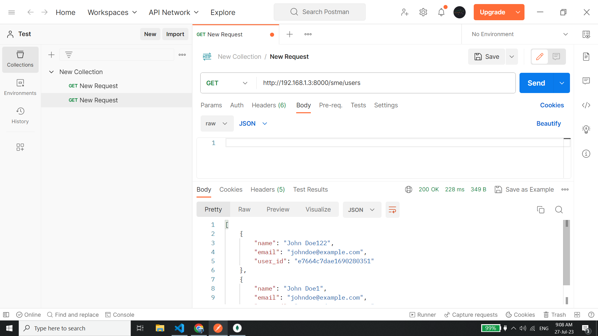

# Flask Application for CRUD Operations on MongoDB

This repository contains a Flask application that enables CRUD (Create, Read, Update, Delete) operations on a MongoDB database for a User resource using a REST API. The application's REST API endpoints are accessible via HTTP requests and can be tested using Postman.

## Requirements

Before running the application, make sure you have the following prerequisites installed on your system:

- Python (3.6 or higher)
- Flask
- PyMongo
- Postman (for testing the REST API endpoints)
- Docker (optional, for containerization)

## Setup

1. **Clone the repository**

   Use Git to clone this repository to your local machine:

   ```bash
   git clone https://github.com/s-chandr/CoRider.git
   cd flask-mongodb-crud
    ```
2. **Install all the required packages**
```
  pip install -r requirements.txt
  ```
3. Set up a .env file to read the environment variables and paste the below lines
```
  DATABASE_URI = mongodb+srv://<username>:<password>@<cluster>.mongodb.net/?retryWrites=true&w=majority

```
replace with your creds generate from mongo atlas.

4. Finally, run the wsgi application
```
  python wsgi.py
```

5. Docker container :
```docker pull schandrdocker/corider-flask-v2```
## REST API Endpoints

### Get All Users

**Endpoint:** `GET /sme/users`

Returns a list of all users.

### Get User by ID

**Endpoint:** `GET /sme/users/<id>`

Returns the user with the specified ID.

### Create New User

**Endpoint:** `POST /sme/users`

Creates a new user with the specified data.


### Update User by ID

**Endpoint:** `PUT /sme/users/<id>`

Updates the user with the specified ID with the new data.


### Delete User by ID

**Endpoint:** `DELETE /sme/users/<id>`

Deletes the user with the specified ID.


### Install MongoDbCompass and use the same DATABASE_URI to connect to view the updates in db

